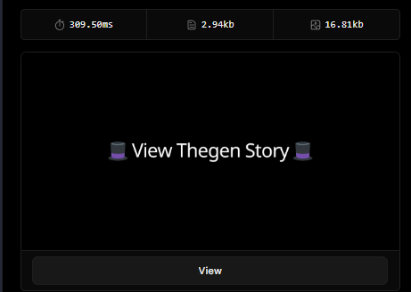
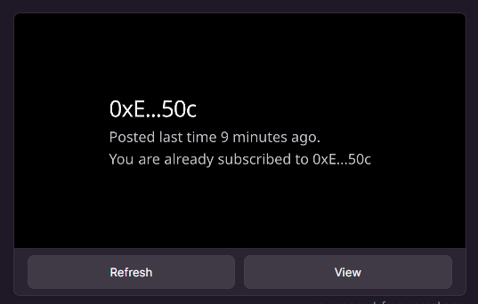

# Thegen Toolkit

<p align="center">
  
</p>

<div align="center">
  <a href="https://docs.scaffoldeth.io">Deck</a> |
  <a href="https://my-second-frog.vercel.app">Live Demo</a> |
  <a href="https://warpcast.com/nevvdevv/0x9d856b5a">Frame Example on</a>
</div>

## Includes
- **Farcaster frame** that renders multiple individual frames based on provided metadata IPFS hash.
- API endpoint `/api/add` for creating and uploading metadata to IPFS through **Pinata**.
- NEXTJS web app for no-code frames creation.
- 'Story' - like frame casts that can no longer be accessed after 24 hours.
- On-chain **$DEGEN** subscribtion-gated content delivery 
- Subscribtion payments in **$DEGEN** and autohrization in-frame.

<p align="center">
  
</p>

## Quick Start

1. 

Prepare `.env` file.

2. 

```
yarn install
yarn run dev
```

3. 

Head to http://localhost:3000/api

4. 

Upload data to IPFS manually to get endpoint for frame or do it through no-code web-based tool.


## Deployments

- Degen Chain - ``

- Arbitrum Stylus Testnet - `0x103a699e06d34f292447AE91c461D11c52060E85`

- Base Sepolia Testnet - `0x0912cfFd0cAEFA02cb84A29420C52155dd94f048`
